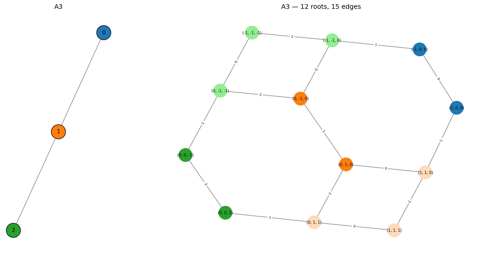

Getting Started
===============

Installation
------------

Clone the repository and install with `uv <https://docs.astral.sh/uv/>`_:

.. code-block:: bash

   git clone <repo-url>
   cd mutation_game
   uv sync

This installs all runtime dependencies (``numpy``, ``networkx``, ``matplotlib``).

Basic Usage
-----------

Create a game from a Dynkin diagram
^^^^^^^^^^^^^^^^^^^^^^^^^^^^^^^^^^^^

The quickest way to get started is with a named Dynkin diagram:

.. code-block:: python

   from mutation import MutationGame

   game = MutationGame.from_dynkin("A3")

Supported types: ``A1``--``An``, ``D4``--``Dn``, ``E6``, ``E7``, ``E8``.

Create a game from an adjacency matrix
^^^^^^^^^^^^^^^^^^^^^^^^^^^^^^^^^^^^^^^^

You can also supply an explicit adjacency matrix:

.. code-block:: python

   adj = [
       [0, 1, 0],
       [1, 0, 1],
       [0, 1, 0],
   ]
   game = MutationGame(adj)

Performing mutations
^^^^^^^^^^^^^^^^^^^^

Set an initial population and mutate individual nodes:

.. code-block:: python

   game = MutationGame.from_dynkin("A3")
   game.set_starting_population([1, 0, 0])

   print(game.mutate(0))  # [-1,  0,  0]
   print(game.mutate(1))  # [-1, -1,  0]

The mutation game rule at node *k* is:

    *Invert the population of the chosen node and add the populations of all
    its neighbors:* ``new[k] = -old[k] + sum(neighbors of k)``

Mutation as matrix multiplication
""""""""""""""""""""""""""""""""""

This rule is a linear transformation. For each node *k*, the mutation matrix
``M_k`` is the identity matrix with row *k* replaced:

.. math::

   (M_k)_{ij} = \begin{cases}
     -1           & \text{if } i = k \text{ and } j = k \\
     \text{adj}_{kj} & \text{if } i = k \text{ and } j \neq k \\
     \delta_{ij}  & \text{if } i \neq k
   \end{cases}

.. admonition:: Example -- A3, mutation at node 1

   The A3 graph is ``0 — 1 — 2``, with adjacency matrix:

   .. math::

      A = \begin{pmatrix} 0 & 1 & 0 \\ 1 & 0 & 1 \\ 0 & 1 & 0 \end{pmatrix}

   Node 1 has neighbors 0 and 2. The mutation matrix ``M_1`` starts as the
   identity, then row 1 is replaced with
   ``[adj(1,0), -1, adj(1,2)] = [1, -1, 1]``:

   .. math::

      M_1 = \begin{pmatrix} 1 & 0 & 0 \\ 1 & -1 & 1 \\ 0 & 0 & 1 \end{pmatrix}

   Applying it to the vector ``v = (3, 1, 2)``:

   .. math::

      M_1 \begin{pmatrix} 3 \\ 1 \\ 2 \end{pmatrix}
      = \begin{pmatrix} 3 \\ 3 - 1 + 2 \\ 2 \end{pmatrix}
      = \begin{pmatrix} 3 \\ 4 \\ 2 \end{pmatrix}

   Node 1's value changed from 1 to ``-1 + 3 + 2 = 4``, while the other
   nodes are unchanged.

Applying mutation *k* is then simply ``v' = M_k @ v``. You can access these
matrices directly:

.. code-block:: pycon

   >>> game = MutationGame.from_dynkin("A3")
   >>> print(game.mutation_matrix(1))
   [[ 1  0  0]
    [ 1 -1  1]
    [ 0  0  1]]

Note that each ``M_k`` is an involution: ``M_k @ M_k = I``. This means
mutating the same node twice restores the original vector.

Computing the root system
^^^^^^^^^^^^^^^^^^^^^^^^^^

.. code-block:: python

   game = MutationGame.from_dynkin("A3")
   roots = game.calculate_roots()
   print(f"A3 has {len(roots)} roots")  # 12

The method explores all reachable vectors by BFS over every possible mutation
sequence, starting from the simple roots ``e_i`` and ``-e_i``. It first checks
that the Cartan matrix is positive definite (see :doc:`background`), ensuring
the root system is finite. For non-finite-type graphs, a ``RuntimeError`` is
raised immediately.

Known root counts:

.. list-table::
   :header-rows: 1

   * - Type
     - Total roots
   * - A\ :sub:`n`
     - n(n + 1)
   * - D\ :sub:`n`
     - 2n(n - 1)
   * - E\ :sub:`6`
     - 72
   * - E\ :sub:`7`
     - 126
   * - E\ :sub:`8`
     - 240

Finding mutation paths
^^^^^^^^^^^^^^^^^^^^^^^

Given two roots, ``find_mutation_path`` returns the shortest sequence of
mutations to transform one into the other:

.. code-block:: pycon

   >>> game = MutationGame.from_dynkin("A3")
   >>> path = game.find_mutation_path([1, 0, 0], [1, 1, 1])
   >>> for mut_idx, result in path:
   ...     print(f"  mutate node {mut_idx} -> {list(map(int, result))}")
     mutate node 1 -> [1, 1, 0]
     mutate node 2 -> [1, 1, 1]

Starting from the simple root ``(1, 0, 0)``, we reach ``(1, 1, 1)`` in two
mutations: first mutate node 1, then node 2.

Each step is a ``(mutation_index, resulting_vector)`` pair. The method raises
``ValueError`` if either vector is not a root in the system.

Mutation path table
^^^^^^^^^^^^^^^^^^^^

To see the shortest paths between all pairs of roots at once, use
``print_mutation_path_table``:

.. code-block:: pycon

   >>> game = MutationGame.from_dynkin("A3")
   >>> game.print_mutation_path_table()
   Source     Target     Mutations         Len
   -------------------------------------------
   (0, 0, 1)  (0, 1, 0)  1 -> 2            2
   (0, 0, 1)  (0, 1, 1)  1                 1
   (0, 0, 1)  (1, 0, 0)  1 -> 2 -> 0 -> 1  4
   (0, 0, 1)  (1, 1, 0)  1 -> 2 -> 0       3
   (0, 0, 1)  (1, 1, 1)  1 -> 0            2
   (0, 1, 0)  (0, 1, 1)  2                 1
   (0, 1, 0)  (1, 0, 0)  0 -> 1            2
   (0, 1, 0)  (1, 1, 0)  0                 1
   (0, 1, 0)  (1, 1, 1)  0 -> 2            2
   (0, 1, 1)  (1, 0, 0)  2 -> 0 -> 1       3
   (0, 1, 1)  (1, 1, 0)  2 -> 0            2
   (0, 1, 1)  (1, 1, 1)  0                 1
   (1, 0, 0)  (1, 1, 0)  1                 1
   (1, 0, 0)  (1, 1, 1)  1 -> 2            2
   (1, 1, 0)  (1, 1, 1)  2                 1

By default only positive roots are included. Pass ``positive_only=False`` for
the full table. The programmatic version ``mutation_path_table()`` returns a
list of dicts for further processing.

.. note::

   Each mutation is an involution (applying it twice restores the original
   vector), so every path is reversible: to go from B back to A, apply the
   same mutations in **reverse order**. For example, if ``1 -> 2 -> 0``
   transforms A into B, then ``0 -> 2 -> 1`` transforms B back into A. This
   is why the table lists each pair only once.

Plotting
--------

Positive roots (default)
^^^^^^^^^^^^^^^^^^^^^^^^^

By default, ``plot_root_orbits`` shows only the positive roots arranged in a
hierarchical layout, with simple roots at the top:

.. code-block:: python

   game = MutationGame.from_dynkin("A3")
   fig = game.plot_root_orbits()
   fig.savefig("a3_positive.png", bbox_inches="tight", dpi=150)

.. image:: _static/a3_positive.png
   :width: 100%
   :alt: A3 positive roots

The left panel shows the input Dynkin diagram. Each node has a distinct color
that matches the corresponding simple root in the mutation graph on the right.
Edges in the mutation graph are labeled with the index of the mutated node.

All roots
^^^^^^^^^^

Pass ``positive_only=False`` to see both positive and negative roots:

.. code-block:: python

   fig = game.plot_root_orbits(positive_only=False)
   fig.savefig("a3_all.png", bbox_inches="tight", dpi=150)

Color scheme:

- **Distinct color per node** -- simple roots ``+e_i`` and ``-e_i`` share the
  color of node *i* in the Dynkin diagram
- **Peachpuff** -- non-simple positive roots
- **Light green** -- non-simple negative roots

Larger examples
^^^^^^^^^^^^^^^^

D4:

.. code-block:: python

   game = MutationGame.from_dynkin("D4")
   fig = game.plot_root_orbits()
   fig.savefig("d4_positive.png", bbox_inches="tight", dpi=150)

.. image:: _static/d4_positive.png
   :width: 100%
   :alt: D4 positive roots

E6:

.. code-block:: python

   game = MutationGame.from_dynkin("E6")
   fig = game.plot_root_orbits()
   fig.savefig("e6_positive.png", bbox_inches="tight", dpi=150)

.. image:: _static/e6_positive.png
   :width: 100%
   :alt: E6 positive roots
