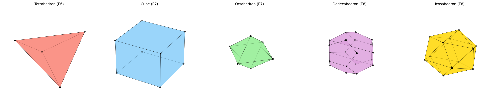
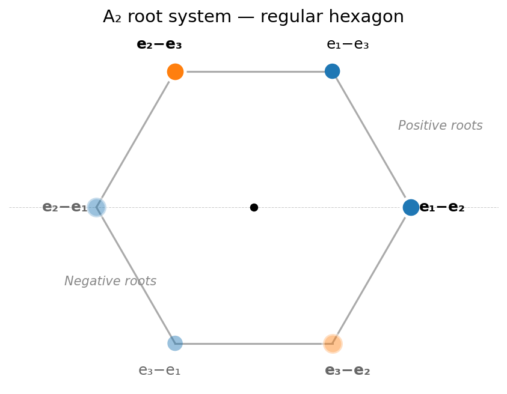
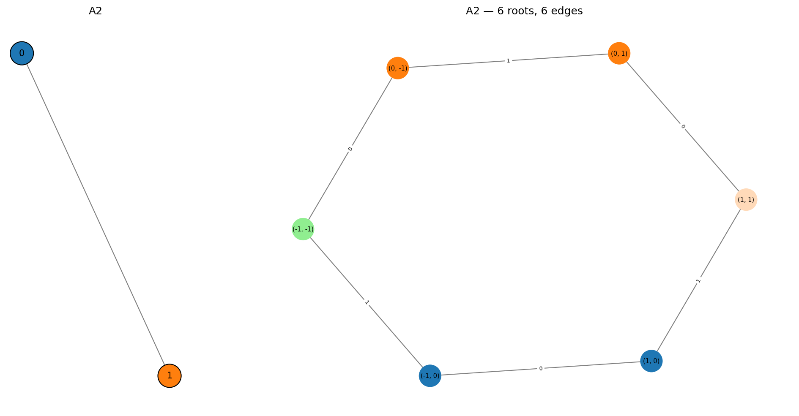

From Platonic Solids to Dynkin Diagrams
========================================

The same Diophantine inequality :math:`\frac{1}{p+1} + \frac{1}{q+1} + \frac{1}{r+1} > 1`
that classifies ADE Dynkin diagrams (see :doc:`classification_proof`) also
classifies the Platonic solids, finite rotation groups, and spherical triangle
groups. This section traces the chain of connections.

1. Euler's Formula and Regular Polyhedra
-----------------------------------------

A **regular polyhedron** (Platonic solid) is a convex polyhedron whose faces
are congruent regular polygons and whose vertices all have the same valence.
Let a regular polyhedron have:

- :math:`V` vertices, each of valence :math:`q` (edges meeting at each vertex)
- :math:`E` edges
- :math:`F` faces, each a regular :math:`p`-gon

**Euler's polyhedron formula** gives:

.. math::

   V - E + F = 2

Each edge borders 2 faces and connects 2 vertices, so:

.. math::

   pF = 2E, \qquad qV = 2E

Substituting into Euler's formula:

.. math::

   \frac{2E}{q} - E + \frac{2E}{p} = 2

Dividing by :math:`2E`:

.. math::

   \frac{1}{q} + \frac{1}{p} - \frac{1}{2} = \frac{1}{E}

Since :math:`E > 0`, we need:

.. math::
   :label: platonic-ineq

   \frac{1}{p} + \frac{1}{q} > \frac{1}{2}

with :math:`p \geq 3` (faces are at least triangles) and :math:`q \geq 3`
(at least 3 edges meet at each vertex).

2. Enumerating Solutions
-------------------------

We enumerate all integer solutions of :eq:`platonic-ineq` with
:math:`3 \leq p \leq q` (by duality, swapping :math:`p` and :math:`q` gives
the dual polyhedron):

**Case** :math:`p = 3` (triangular faces):

.. math::

   \frac{1}{3} + \frac{1}{q} > \frac{1}{2}
   \quad\Longleftrightarrow\quad
   q < 6

- :math:`q = 3`: :math:`E = 6` -- **Tetrahedron** (4 vertices, 4 faces)
- :math:`q = 4`: :math:`E = 12` -- **Octahedron** (6 vertices, 8 faces)
- :math:`q = 5`: :math:`E = 30` -- **Icosahedron** (12 vertices, 20 faces)

**Case** :math:`p = 4` (square faces):

- :math:`q = 3`: :math:`E = 12` -- **Cube** (8 vertices, 6 faces) -- dual of octahedron

**Case** :math:`p = 5` (pentagonal faces):

- :math:`q = 3`: :math:`E = 30` -- **Dodecahedron** (20 vertices, 12 faces) -- dual of icosahedron

**Case** :math:`p \geq 6`: :math:`\frac{1}{p} + \frac{1}{q} \leq \frac{1}{6} + \frac{1}{6} < \frac{1}{2}`. **No solutions.**

That gives exactly **5 Platonic solids** (3 + 2 duals). Each is labeled
below with its corresponding Dynkin type -- the tetrahedron corresponds to
:math:`E_6`, the cube/octahedron dual pair to :math:`E_7`, and the
dodecahedron/icosahedron dual pair to :math:`E_8`.

**Interactive 3D viewer** -- click and drag to rotate, scroll to zoom
(`open fullscreen <_static/platonic_viewer.html>`__):

.. raw:: html

   <iframe src="_static/platonic_viewer.html"
     style="width:100%; height:380px; border:1px solid #444; border-radius:6px; background:#1a1a2e;"
     loading="lazy" allowfullscreen></iframe>
   <noscript>

.. raw:: html

   </noscript>

3. The Rotation Groups
------------------------

Each Platonic solid has a **rotation group** -- the group of orientation-preserving
symmetries. Up to conjugacy, these are exactly the finite subgroups of
:math:`SO(3)`:

.. list-table::
   :header-rows: 1

   * - Solid
     - :math:`(p, q)`
     - Rotation group
     - Order
     - Generators
   * - Tetrahedron
     - (3, 3)
     - :math:`A_4` (alternating)
     - 12
     - 3-fold and 2-fold rotations
   * - Cube / Octahedron
     - (4, 3) / (3, 4)
     - :math:`S_4` (symmetric)
     - 24
     - 4-fold, 3-fold, 2-fold rotations
   * - Dodecahedron / Icosahedron
     - (5, 3) / (3, 5)
     - :math:`A_5` (alternating)
     - 60
     - 5-fold, 3-fold, 2-fold rotations

Additionally, there are two infinite families of finite subgroups of
:math:`SO(3)`:

- **Cyclic groups** :math:`C_n` (rotation by :math:`2\pi/n` about an axis)
- **Dihedral groups** :math:`D_n` (rotations of a regular :math:`n`-gon, including flips)

**Theorem.** *The finite subgroups of* :math:`SO(3)` *are exactly: cyclic*
:math:`C_n`, *dihedral* :math:`D_n`, *and the three polyhedral groups*
:math:`A_4, S_4, A_5`.

4. The McKay Correspondence: From SO(3) to SU(2) to Dynkin
------------------------------------------------------------

The rotation group :math:`SO(3)` has a double cover :math:`SU(2)` (the group
of unit quaternions). Every finite subgroup :math:`G \subset SO(3)` lifts to a
**binary** subgroup :math:`\tilde{G} \subset SU(2)` of twice the order:

.. list-table::
   :header-rows: 1

   * - :math:`SO(3)` subgroup
     - :math:`SU(2)` lift
     - Order
     - Dynkin diagram
   * - :math:`C_n` (cyclic)
     - Binary cyclic :math:`\tilde{C}_n`
     - :math:`2n`
     - :math:`A_{n-1}`
   * - :math:`D_n` (dihedral)
     - Binary dihedral :math:`\tilde{D}_n`
     - :math:`4n`
     - :math:`D_{n+2}`
   * - :math:`A_4` (tetrahedral)
     - Binary tetrahedral :math:`\tilde{T}`
     - 24
     - :math:`E_6`
   * - :math:`S_4` (octahedral)
     - Binary octahedral :math:`\tilde{O}`
     - 48
     - :math:`E_7`
   * - :math:`A_5` (icosahedral)
     - Binary icosahedral :math:`\tilde{I}`
     - 120
     - :math:`E_8`

The **McKay correspondence** (John McKay, 1980) explains *how* the Dynkin
diagram emerges from the group. It works as follows:

**Step 1.** Let :math:`\tilde{G} \subset SU(2)` be a finite subgroup. The
natural 2-dimensional representation :math:`\rho` of :math:`\tilde{G}`
(inherited from :math:`SU(2)`) is called the **fundamental representation**.

**Step 2.** List all irreducible representations :math:`\rho_0, \rho_1, \ldots, \rho_r`
of :math:`\tilde{G}`, where :math:`\rho_0` is the trivial representation.

**Step 3.** For each :math:`\rho_i`, decompose the tensor product with the
fundamental representation:

.. math::

   \rho \otimes \rho_i = \bigoplus_j a_{ij} \rho_j

**Step 4.** Build a graph with one node per irreducible representation, and
:math:`a_{ij}` edges between nodes :math:`i` and :math:`j`.

**Result.** The graph obtained is the **extended** (affine) Dynkin diagram
:math:`\tilde{A}_{n-1}`, :math:`\tilde{D}_{n+2}`, :math:`\tilde{E}_6`,
:math:`\tilde{E}_7`, or :math:`\tilde{E}_8`. Removing the node corresponding
to the trivial representation :math:`\rho_0` gives the ordinary Dynkin
diagram.

5. Spherical Triangle Groups
------------------------------

A **spherical triangle** is a triangle on the unit sphere :math:`S^2` with
angles :math:`\pi/p`, :math:`\pi/q`, :math:`\pi/r`. The **triangle group**
:math:`\Delta(p, q, r)` is generated by reflections in the sides of this
triangle.

On a sphere, the angle sum of a triangle exceeds :math:`\pi`:

.. math::

   \frac{\pi}{p} + \frac{\pi}{q} + \frac{\pi}{r} > \pi

Dividing by :math:`\pi`:

.. math::

   \frac{1}{p} + \frac{1}{q} + \frac{1}{r} > 1

This is exactly the same inequality as in the ADE classification (see
:doc:`classification_proof`, equation :eq:`diophantine`), with the
identification :math:`p \to p+1`, :math:`q \to q+1`, :math:`r \to r+1` (the
triangle group uses the actual angles, while the Dynkin classification uses
arm lengths).

The spherical triangle groups are:

.. list-table::
   :header-rows: 1

   * - Triangle :math:`(p, q, r)`
     - Triangle group
     - Rotation subgroup
     - Dynkin diagram
   * - :math:`(2, 2, n)`
     - Dihedral
     - :math:`D_n`
     - :math:`A_{n-1}` / :math:`D_{n+2}`
   * - :math:`(2, 3, 3)`
     - Tetrahedral
     - :math:`A_4`
     - :math:`E_6`
   * - :math:`(2, 3, 4)`
     - Octahedral
     - :math:`S_4`
     - :math:`E_7`
   * - :math:`(2, 3, 5)`
     - Icosahedral
     - :math:`A_5`
     - :math:`E_8`

When :math:`\frac{1}{p} + \frac{1}{q} + \frac{1}{r} = 1`, the triangle is
**Euclidean** (flat) and tiles the plane -- these correspond to the affine
Dynkin diagrams. When the sum is :math:`< 1`, the triangle is **hyperbolic**.

6. The Unified Picture
-----------------------

All these classifications are manifestations of the same Diophantine
constraint. The connections can be summarized as:

.. math::

   \frac{1}{p} + \frac{1}{q} + \frac{1}{r} > 1

.. list-table::
   :header-rows: 1
   :widths: 10 20 20 20 20

   * - :math:`(p,q,r)`
     - Dynkin
     - Platonic solid
     - :math:`SO(3)` group
     - Singularity
   * - :math:`(2,2,n)`
     - :math:`D_{n+2}`
     - :math:`n`-gon prism
     - Dihedral :math:`D_n`
     - :math:`x^2 y + y^{n+1}`
   * - :math:`(2,3,3)`
     - :math:`E_6`
     - Tetrahedron
     - :math:`A_4`
     - :math:`x^3 + y^4`
   * - :math:`(2,3,4)`
     - :math:`E_7`
     - Cube / Octahedron
     - :math:`S_4`
     - :math:`x^3 + xy^3`
   * - :math:`(2,3,5)`
     - :math:`E_8`
     - Dodecahedron / Icosahedron
     - :math:`A_5`
     - :math:`x^3 + y^5`

The :math:`A_n` family (path graphs) corresponds to the cyclic groups and the
:math:`x^{n+1}` singularities. They don't correspond to Platonic solids
(which require :math:`p, q \geq 3`), but rather to the simpler geometry of a
regular polygon.

We can verify the Dynkin diagrams and root counts for all these types:

.. code-block:: pycon

   >>> from mutation_game import MutationGame

   >>> # the five exceptional connections
   >>> for name, solid in [("E6", "Tetrahedron"),
   ...                      ("E7", "Cube/Octahedron"),
   ...                      ("E8", "Dodecahedron/Icosahedron")]:
   ...     game = MutationGame.from_dynkin(name)
   ...     roots = game.calculate_roots()
   ...     pos = [r for r in roots if all(v >= 0 for v in r)]
   ...     print(f"  {name} ({solid}): {len(pos)} positive roots, {len(roots)} total")
     E6 (Tetrahedron): 36 positive roots, 72 total
     E7 (Cube/Octahedron): 63 positive roots, 126 total
     E8 (Dodecahedron/Icosahedron): 120 positive roots, 240 total

Root systems as geometric shapes
^^^^^^^^^^^^^^^^^^^^^^^^^^^^^^^^^

Before jumping to 3D, let us build the intuition in 2D with the simplest
interesting example.

A\ :sub:`2`\ : the hexagon (2D)
"""""""""""""""""""""""""""""""""

**Where do the roots live?** The :math:`A_2` Dynkin diagram has 2 nodes
connected by one edge: ``0 — 1``. The mutation game produces 6 roots: 3
positive and 3 negative. But these are just coordinate vectors in
:math:`\mathbb{R}^2` — abstract lists of numbers. To *see* the geometry,
we need to understand what shape they make when drawn as points.

**Step 1: Compute the roots from the mutation game.**

This is the definition: the roots are whatever the mutation game produces,
starting from the simple roots :math:`(1, 0)` and :math:`(0, 1)`, by
applying the mutation matrices :math:`M_0` and :math:`M_1` in every possible
sequence.

.. code-block:: pycon

   >>> from mutation_game import MutationGame
   >>> game = MutationGame.from_dynkin("A2")

   >>> # The two mutation matrices
   >>> print("M_0 ="); print(game.mutation_matrix(0))
   M_0 =
   [[-1  1]
    [ 0  1]]
   >>> print("M_1 ="); print(game.mutation_matrix(1))
   M_1 =
   [[ 1  0]
    [ 1 -1]]

   >>> # Start from simple root (1, 0) and apply mutations
   >>> import numpy as np
   >>> v = np.array([1, 0])           # simple root alpha_0
   >>> print("Start:", v)
   Start: [1 0]
   >>> print("M_1 @ v:", game.mutation_matrix(1) @ v)   # mutate at node 1
   M_1 @ v: [1 1]
   >>> # (1, 1) is new! That's the third positive root.
   >>> # Mutating (1, 1) at node 0:
   >>> print("M_0 @ (1,1):", game.mutation_matrix(0) @ np.array([1, 1]))
   M_0 @ (1,1): [0 1]
   >>> # We got back to (0, 1) — the other simple root. No new roots this way.
   >>> # Mutating (1, 0) at node 0 just negates it:
   >>> print("M_0 @ v:", game.mutation_matrix(0) @ v)
   M_0 @ v: [-1  0]
   >>> # (-1, 0) is the negative of a simple root

   >>> # The full BFS gives all 6 roots
   >>> roots = game.calculate_roots()
   >>> for r in roots:
   ...     print(list(map(int, r)))
   [-1, -1]
   [-1, 0]
   [0, -1]
   [0, 1]
   [1, 0]
   [1, 1]

So the mutation game has produced 6 roots in :math:`\mathbb{R}^2`:
:math:`(1,0)`, :math:`(0,1)`, :math:`(1,1)`, and their negatives. These are
abstract vectors in the **simple root basis**. The question is: what shape
do they make?

**Step 2: The standard embedding in** :math:`\mathbb{R}^3`.

We could plot these 6 vectors directly in :math:`\mathbb{R}^2`, but the
result looks skewed — the simple roots :math:`(1,0)` and :math:`(0,1)` appear
to be at a 90-degree angle, even though the Cartan matrix tells us they
should meet at 120 degrees (since
:math:`\langle \alpha_0, \alpha_1 \rangle = C_{01} = -1`, which corresponds
to an angle of :math:`2\pi/3`). The simple root basis is not orthonormal, so
raw coordinates distort the geometry.

To see the *true shape*, we embed the roots in :math:`\mathbb{R}^{n+1}`
(one dimension more than the number of nodes), where the symmetry becomes
manifest. For :math:`A_2` (2 nodes), we work in :math:`\mathbb{R}^3`. Define
three unit vectors along the coordinate axes:

.. math::

   e_1 = (1, 0, 0), \quad e_2 = (0, 1, 0), \quad e_3 = (0, 0, 1)

The **simple roots** of :math:`A_2` are embedded as:

.. math::

   \alpha_0 = e_1 - e_2 = (1, -1, 0), \qquad
   \alpha_1 = e_2 - e_3 = (0, 1, -1)

These are the two vectors that correspond to the nodes of the Dynkin diagram.
They are the "building blocks" that generate all the roots.

**Step 3: Translate all 6 roots into** :math:`\mathbb{R}^3`.

Each root :math:`(a, b)` in the simple root basis means
:math:`a \cdot \alpha_0 + b \cdot \alpha_1`:

.. math::

   \begin{array}{rcccl}
   (1, 0) &=& 1 \cdot \alpha_0 + 0 \cdot \alpha_1 &=& e_1 - e_2 = (1, -1, 0) \\
   (0, 1) &=& 0 \cdot \alpha_0 + 1 \cdot \alpha_1 &=& e_2 - e_3 = (0, 1, -1) \\
   (1, 1) &=& 1 \cdot \alpha_0 + 1 \cdot \alpha_1 &=& e_1 - e_3 = (1, 0, -1) \\[6pt]
   (-1, 0) &=& -\alpha_0 &=& e_2 - e_1 = (-1, 1, 0) \\
   (0, -1) &=& -\alpha_1 &=& e_3 - e_2 = (0, -1, 1) \\
   (-1, -1) &=& -\alpha_0 - \alpha_1 &=& e_3 - e_1 = (-1, 0, 1)
   \end{array}

Look at the result: the 6 roots in :math:`\mathbb{R}^3` are exactly **all
differences** :math:`e_i - e_j` with :math:`i \neq j`. This is not a
definition — it is a consequence of the mutation game. The mutations
happened to produce precisely the vectors that can be written as
:math:`e_i - e_j`.

Each negative root is the opposite of a positive root:
:math:`-(e_1 - e_2) = e_2 - e_1`.

**Step 4: All roots lie on a plane.** Check the coordinates — every root
has components that sum to zero:

.. math::

   (1) + (-1) + (0) = 0, \quad (0) + (1) + (-1) = 0, \quad \text{etc.}

This means all 6 vectors lie on the plane :math:`x + y + z = 0` inside
:math:`\mathbb{R}^3`. This plane passes through the origin and is
2-dimensional, so we can draw the roots as points on a flat sheet of paper.

**Step 5: See the hexagon.** When we project these 6 points onto the plane,
they are all at the same distance from the origin (:math:`\sqrt{2}`), and
equally spaced at 60-degree intervals. They form a perfect **regular
hexagon**:

The two **simple roots** :math:`e_1 - e_2` and :math:`e_2 - e_3` (shown as
larger dots with white borders) are adjacent vertices of the hexagon. The
third positive root :math:`e_1 - e_3` is their sum — it sits between them.
The three negative roots sit on the opposite side.

**Step 6: The symmetry group.** The hexagon has the symmetry of an
**equilateral triangle** (the triangle formed by the 3 positive roots). This
symmetry group is :math:`S_3` — the group of all permutations of 3 objects —
which has :math:`3! = 6` elements (3 rotations + 3 reflections).

Why :math:`S_3`? Because permuting the indices :math:`\{1, 2, 3\}` in
:math:`e_i - e_j` sends roots to roots. For example, the transposition
:math:`(1 \leftrightarrow 2)` sends :math:`e_1 - e_2 \mapsto e_2 - e_1`,
which swaps a positive root with its negative. This is exactly what a
**mutation** does — and the group generated by all mutations is the Weyl
group :math:`S_3`.

.. code-block:: pycon

   >>> # The Cartan matrix: inner products of simple roots
   >>> print(game.cartan_matrix())
   [[ 2 -1]
    [-1  2]]

   >>> # The Coxeter element (product of both mutations)
   >>> M = game.mutation_matrix(0) @ game.mutation_matrix(1)
   >>> print(M)
   [[ 0 -1]
    [ 1 -1]]
   >>> # This matrix has order 3: M^3 = I (a 120-degree rotation of the hexagon)
   >>> print(M @ M @ M)
   [[1 0]
    [0 1]]

The mutation graph also forms a hexagon — the same shape! Here each node is
a root vector, and the edges show which mutation transforms one root into
another:

The hexagonal shape appears in both the root geometry (points in the plane)
and the mutation graph (how roots are connected by mutations). This is not a
coincidence — it reflects the underlying :math:`S_3` symmetry.

A\ :sub:`3`\ : the cuboctahedron (3D)
"""""""""""""""""""""""""""""""""""""""

Now we go up one dimension. The :math:`A_3` Dynkin diagram has 3 nodes in a
path: ``0 — 1 — 2``. The exact same construction that gave us a hexagon in
2D now gives us a 3D shape.

**Step 1: Standard basis vectors in** :math:`\mathbb{R}^4`.

.. math::

   e_1 = (1,0,0,0), \quad e_2 = (0,1,0,0), \quad e_3 = (0,0,1,0), \quad e_4 = (0,0,0,1)

**Step 2: Form the roots.** All differences :math:`e_i - e_j` with
:math:`i \neq j`. There are :math:`4 \times 3 = 12` of them — 6 positive
(:math:`i < j`) and 6 negative (:math:`i > j`).

**Step 3: Project to 3D.** All 12 vectors satisfy :math:`x + y + z + w = 0`,
so they lie on a 3-dimensional hyperplane inside :math:`\mathbb{R}^4`.

**Step 4: See the cuboctahedron.** The 12 points form a
**cuboctahedron** — an Archimedean solid with 8 triangular faces and 6
square faces. It is the shape you get by cutting every corner of a cube at
the midpoint of each edge.

**Step 5: The symmetry group.** The cuboctahedron has the symmetry of the
**cube** (and its dual the octahedron). The rotation group is :math:`S_4`
(permutations of 4 objects, order 24) — exactly the Weyl group of :math:`A_3`.

The pattern:

.. list-table::
   :header-rows: 1

   * - Type
     - Roots
     - Shape
     - Weyl group
     - Symmetry of...
   * - :math:`A_1`
     - 2
     - Line segment
     - :math:`S_2 = \mathbb{Z}/2` (order 2)
     - \—
   * - :math:`A_2`
     - 6
     - Regular hexagon
     - :math:`S_3` (order 6)
     - Equilateral triangle
   * - :math:`A_3`
     - 12
     - Cuboctahedron
     - :math:`S_4` (order 24)
     - Cube / Octahedron
   * - :math:`A_4`
     - 20
     - 4D polytope
     - :math:`S_5` (order 120)
     - 5-cell (4D simplex)

Each step up adds one dimension and one node to the Dynkin diagram, and the
root polytope gains a dimension accordingly.

The mutation graph of the full :math:`A_3` root system (both positive and
negative roots), with 12 roots and 15 mutation edges:

.. image:: _static/a3_all_roots.png
   :width: 100%
   :alt: A3 full mutation graph -- 12 roots, 15 edges

The same 12 roots realized as vertices of the cuboctahedron in 3D
(`open fullscreen <_static/roots_viewer.html>`__):

.. raw:: html

   <iframe src="_static/roots_viewer.html"
     style="width:100%; height:420px; border:1px solid #444; border-radius:6px; background:#1a1a2e;"
     loading="lazy" allowfullscreen></iframe>

Each vertex of the cuboctahedron is a root :math:`e_i - e_j`, colored by
the **dominant simple root** using the same tab10 palette as the mutation
graph: node 0 in blue, node 1 in orange, node 2 in green. Lighter shades
mark positive roots (:math:`i < j`), darker shades mark negative roots.
Simple roots :math:`e_i - e_{i+1}` appear as larger saturated spheres.

Edges are colored by **mutation index** -- blue edges correspond to mutation
at node 0, orange to node 1, green to node 2 -- matching the edge labels in
the static mutation graph.

The cuboctahedral geometry reflects the :math:`S_4` symmetry of the Weyl group
-- the same group as the rotation group of the cube/octahedron.

.. note::

   The 240 roots of :math:`E_8` can be realized as vectors in
   :math:`\mathbb{R}^8`. Their convex hull is the **Gosset polytope**
   :math:`4_{21}`, a remarkable 8-dimensional object with 240 vertices,
   6720 edges, and deep connections to string theory and the octonions.

7. The du Val Singularities
-----------------------------

The circle closes with the **du Val singularities** (also called rational
double points or Kleinian singularities). Given a finite subgroup
:math:`\tilde{G} \subset SU(2)`, consider its action on :math:`\mathbb{C}^2`.
The quotient :math:`\mathbb{C}^2 / \tilde{G}` is a surface with an isolated
singularity at the origin, and this singularity is of ADE type:

.. list-table::
   :header-rows: 1

   * - Group :math:`\tilde{G}`
     - Quotient singularity
     - Equation in :math:`\mathbb{C}^3`
     - Type
   * - Binary cyclic :math:`\tilde{C}_n`
     - :math:`\mathbb{C}^2 / \tilde{C}_n`
     - :math:`x^2 + y^2 + z^n = 0`
     - :math:`A_{n-1}`
   * - Binary dihedral :math:`\tilde{D}_n`
     - :math:`\mathbb{C}^2 / \tilde{D}_n`
     - :math:`x^2 + y^2 z + z^{n-1} = 0`
     - :math:`D_{n+2}`
   * - Binary tetrahedral :math:`\tilde{T}`
     - :math:`\mathbb{C}^2 / \tilde{T}`
     - :math:`x^2 + y^3 + z^4 = 0`
     - :math:`E_6`
   * - Binary octahedral :math:`\tilde{O}`
     - :math:`\mathbb{C}^2 / \tilde{O}`
     - :math:`x^2 + y^3 + yz^3 = 0`
     - :math:`E_7`
   * - Binary icosahedral :math:`\tilde{I}`
     - :math:`\mathbb{C}^2 / \tilde{I}`
     - :math:`x^2 + y^3 + z^5 = 0`
     - :math:`E_8`

The equations in the right column are exactly the ADE singularities from
Arnold's classification (see :doc:`singularities`). The resolution of these
surface singularities produces a configuration of exceptional curves whose
intersection graph is the corresponding Dynkin diagram.

This completes the circle:

.. math::

   \boxed{\text{Platonic solid}}
   \to \boxed{\text{Rotation group}}
   \to \boxed{\text{Binary group } \tilde{G} \subset SU(2)}
   \to \boxed{\mathbb{C}^2 / \tilde{G}}
   \to \boxed{\text{ADE singularity}}
   \to \boxed{\text{Dynkin diagram}}

References
-----------

.. [McKay1980] J. McKay, "Graphs, singularities, and finite groups,"
   *Proceedings of Symposia in Pure Mathematics* 37 (1980), 183--186.

.. [Klein1884] F. Klein, *Vorlesungen uber das Ikosaeder und die Auflosung
   der Gleichungen vom funften Grade*, Teubner, 1884. English translation:
   *Lectures on the Icosahedron*, Dover, 2003.

.. [duVal1934] P. du Val, "On isolated singularities of surfaces which do not
   affect the conditions of adjunction," *Proceedings of the Cambridge
   Philosophical Society* 30 (1934), 453--459.
