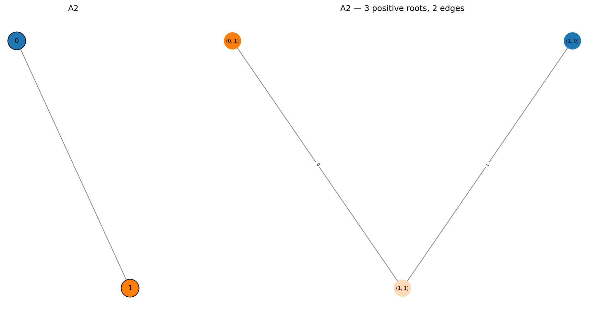
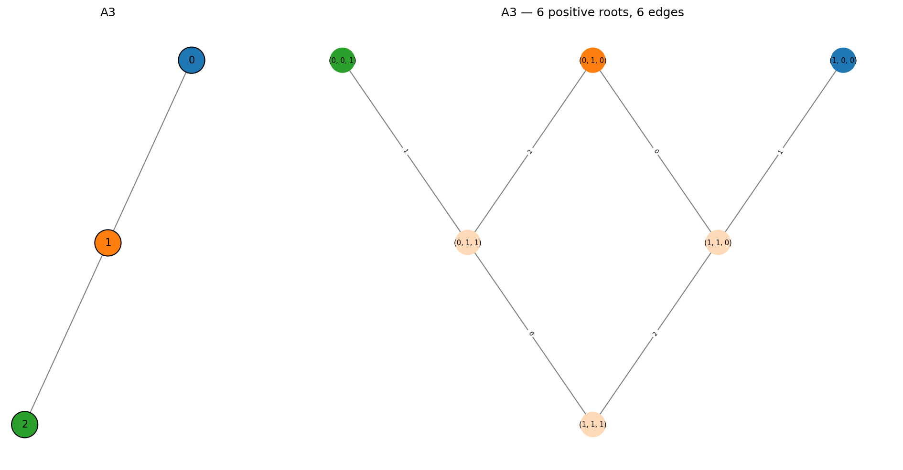
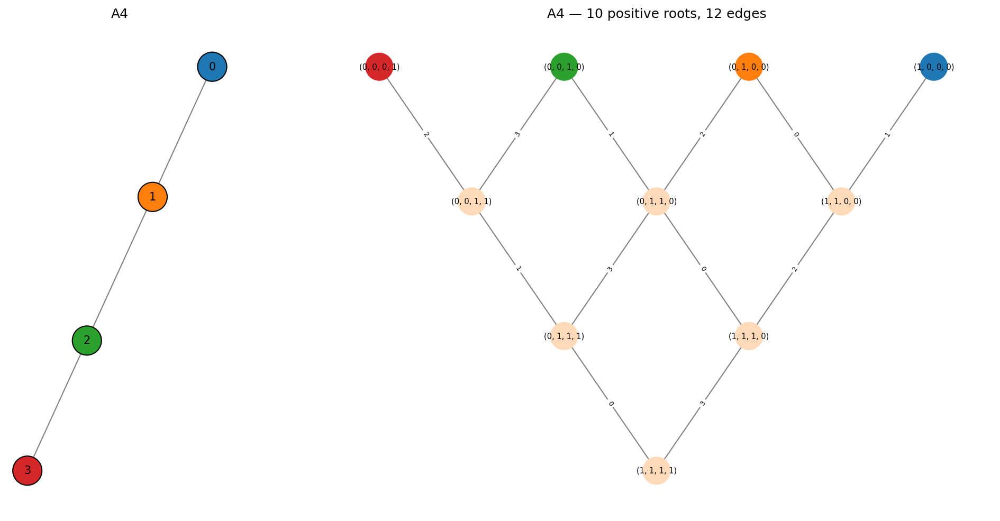
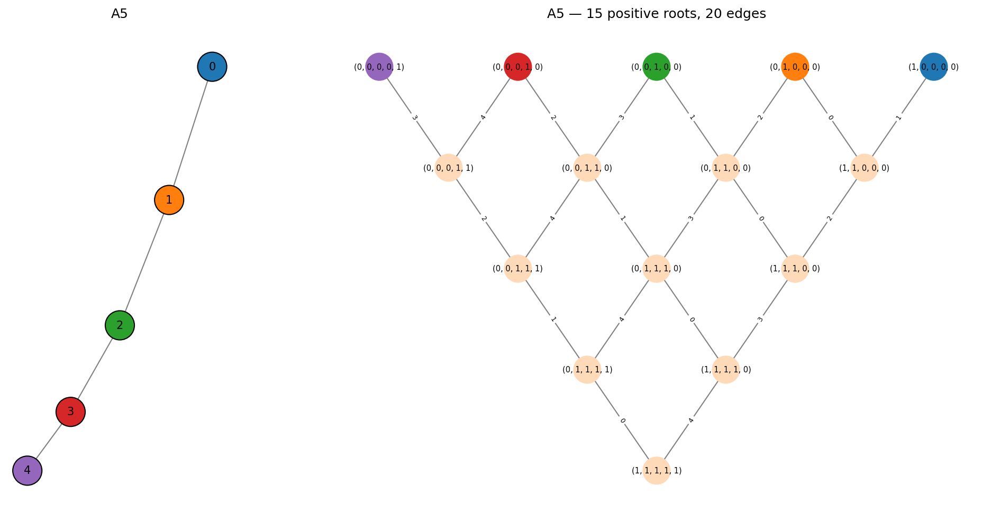

Type A -- Path Graphs
=====================

The :math:`A_n` Dynkin diagram is a path graph on *n* nodes:

.. math::

   0 - 1 - 2 - \cdots - (n{-}1)

The root system has :math:`\frac{n(n+1)}{2}` positive roots and
:math:`n(n+1)` roots in total. These correspond to the root system of
the special linear Lie algebra :math:`\mathfrak{sl}_{n+1}`.

The positive roots are exactly the vectors :math:`e_i + e_{i+1} + \cdots + e_j`
for all :math:`0 \leq i \leq j \leq n{-}1`, i.e. contiguous segments of 1s.

A1
--

The simplest case: a single node with no edges.

.. code-block:: pycon

   >>> from mutation_game import MutationGame
   >>> game = MutationGame.from_dynkin("A1")
   >>> print(game.adj)
   [[0]]
   >>> roots = game.calculate_roots()
   >>> for r in roots:
   ...     print(list(map(int, r)))
   [-1]
   [1]

There is 1 positive root (the simple root itself) and its negative.
The Weyl group is :math:`\mathbb{Z}/2\mathbb{Z}` -- a single reflection.

A2
--

Two nodes connected by a single edge. The root system of
:math:`\mathfrak{sl}_3`.

.. code-block:: pycon

   >>> game = MutationGame.from_dynkin("A2")
   >>> for r in game.calculate_roots():
   ...     print(list(map(int, r)))
   [-1, -1]
   [-1, 0]
   [0, -1]
   [0, 1]
   [1, 0]
   [1, 1]

3 positive roots, 6 total. The highest root is :math:`(1, 1)`.

A3
--

The root system of :math:`\mathfrak{sl}_4`, with 6 positive roots and 12 total.

The mutation path table for A3:

.. code-block:: pycon

   >>> game = MutationGame.from_dynkin("A3")
   >>> game.print_mutation_path_table()
   Source     Target     Mutations         Len
   -------------------------------------------
   (0, 0, 1)  (0, 1, 0)  1 -> 2            2
   (0, 0, 1)  (0, 1, 1)  1                 1
   (0, 0, 1)  (1, 0, 0)  1 -> 2 -> 0 -> 1  4
   (0, 0, 1)  (1, 1, 0)  1 -> 2 -> 0       3
   (0, 0, 1)  (1, 1, 1)  1 -> 0            2
   (0, 1, 0)  (0, 1, 1)  2                 1
   (0, 1, 0)  (1, 0, 0)  0 -> 1            2
   (0, 1, 0)  (1, 1, 0)  0                 1
   (0, 1, 0)  (1, 1, 1)  0 -> 2            2
   (0, 1, 1)  (1, 0, 0)  2 -> 0 -> 1       3
   (0, 1, 1)  (1, 1, 0)  2 -> 0            2
   (0, 1, 1)  (1, 1, 1)  0                 1
   (1, 0, 0)  (1, 1, 0)  1                 1
   (1, 0, 0)  (1, 1, 1)  1 -> 2            2
   (1, 1, 0)  (1, 1, 1)  2                 1

The Cartan matrix and its spectrum:

.. code-block:: pycon

   >>> print(game.cartan_matrix())
   [[ 2 -1  0]
    [-1  2 -1]
    [ 0 -1  2]]
   >>> print(game.cartan_eigenvalues())
   [0.58578644 2.         3.41421356]

A4
--

The root system of :math:`\mathfrak{sl}_5`, with 10 positive roots and 20 total.

A5
--

The root system of :math:`\mathfrak{sl}_6`, with 15 positive roots and 30 total.
This is the largest A-type where the mutation graph remains visually manageable.

