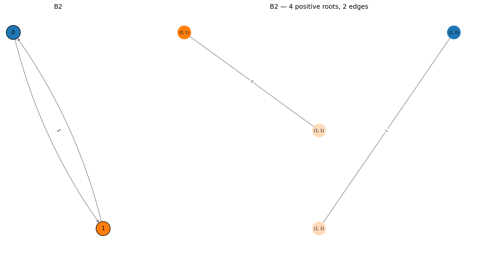
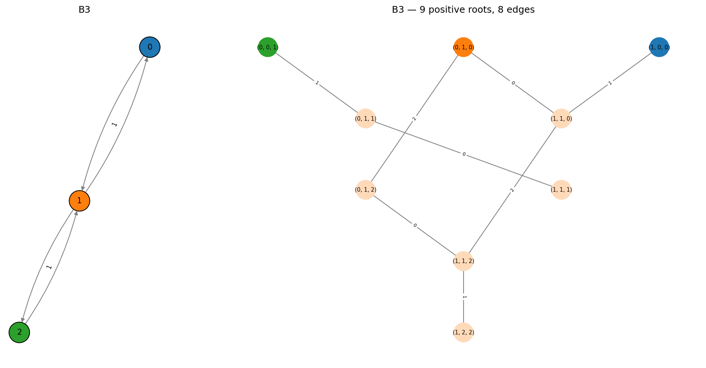
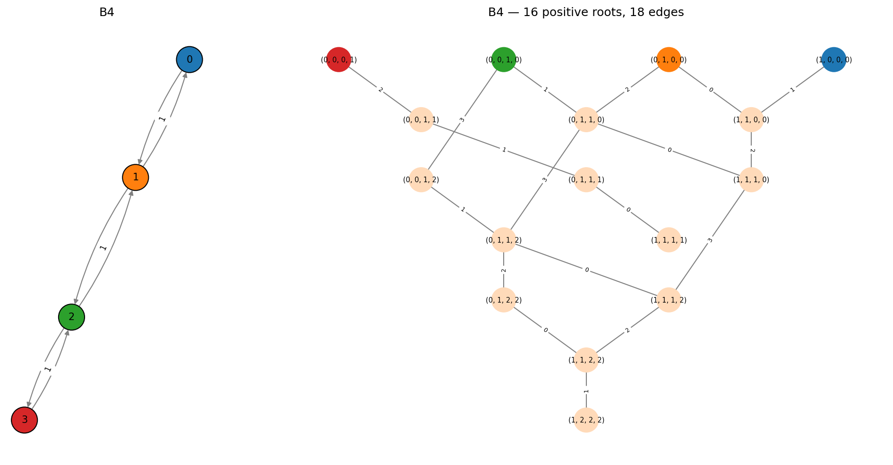

Type B -- Odd Orthogonal
========================

The :math:`B_n` Dynkin diagram (:math:`n \geq 2`) is a directed multigraph:
a path on *n* nodes with a **(2,1) directed edge** at one end.

.. math::

   0 - 1 - \cdots - (n{-}2) \xRightarrow{2,1} (n{-}1)

That is, there are 2 directed edges from node :math:`n{-}2` to :math:`n{-}1`,
and 1 edge back. All other edges are simple (type 1,1).

The root system has :math:`n^2` positive roots and :math:`2n^2` roots in total.
These correspond to the root system of the odd-dimensional orthogonal Lie
algebra :math:`\mathfrak{so}_{2n+1}`.

B2
--

The smallest B-type. 4 positive roots, 8 total.

.. code-block:: pycon

   >>> from mutation_game import MutationGame
   >>> game = MutationGame.from_dynkin("B2")
   >>> print(game.adj)
   [[0 2]
    [1 0]]

The adjacency matrix is **not symmetric**: 2 edges from node 0 to 1, but only
1 edge back. This is what makes the mutation game different from the simply-laced
case -- mutating at node 1 receives 2 copies from node 0.

.. code-block:: pycon

   >>> for r in game.calculate_roots():
   ...     if all(x >= 0 for x in r):
   ...         print(list(map(int, r)))
   [0, 1]
   [1, 0]
   [1, 1]
   [1, 2]

B3
--

9 positive roots, 18 total. The root system of :math:`\mathfrak{so}_7`.

.. code-block:: pycon

   >>> game = MutationGame.from_dynkin("B3")
   >>> print(game.adj)
   [[0 1 0]
    [1 0 2]
    [0 1 0]]

Note how the double edge appears in the middle of the adjacency matrix:
``adj[1,2] = 2`` (two edges from 1 to 2) while ``adj[2,1] = 1``.

B4
--

16 positive roots, 32 total. The root system of :math:`\mathfrak{so}_9`.

