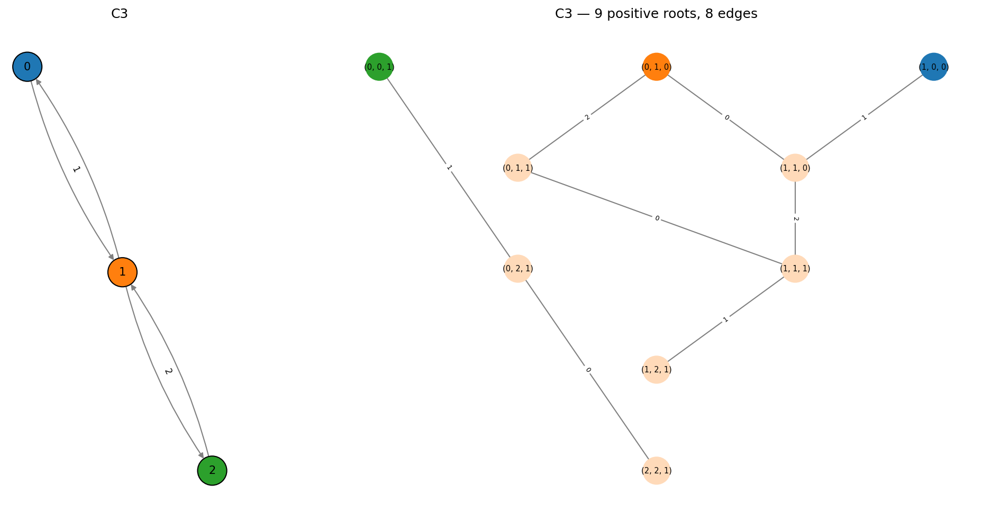
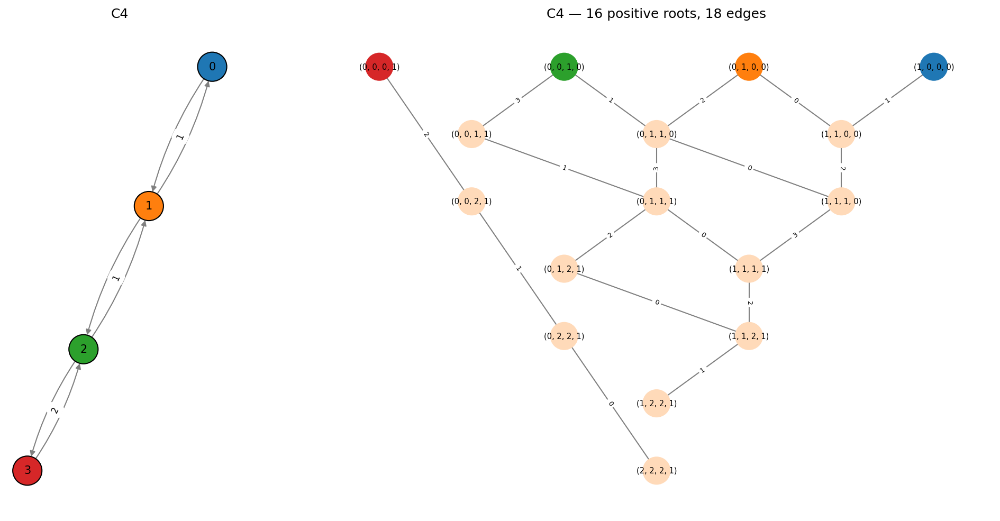

Type C -- Symplectic
====================

The :math:`C_n` Dynkin diagram (:math:`n \geq 3`) is a directed multigraph:
a path on *n* nodes with a **(1,2) directed edge** at one end.

.. math::

   0 - 1 - \cdots - (n{-}2) \xLeftarrow{1,2} (n{-}1)

That is, there is 1 directed edge from node :math:`n{-}2` to :math:`n{-}1`,
and 2 edges back. This is the **reverse** of the B-type double edge.

The root system has :math:`n^2` positive roots and :math:`2n^2` total -- the
same count as :math:`B_n`. These correspond to the root system of the
symplectic Lie algebra :math:`\mathfrak{sp}_{2n}`.

.. note::

   The B/C notation here follows Wildberger's convention (based on the
   directed multigraph structure), which is swapped relative to the
   Bourbaki convention.

C3
--

9 positive roots, 18 total. The root system of :math:`\mathfrak{sp}_6`.

.. code-block:: pycon

   >>> from mutation_game import MutationGame
   >>> game = MutationGame.from_dynkin("C3")
   >>> print(game.adj)
   [[0 1 0]
    [1 0 1]
    [0 2 0]]

Here ``adj[2,1] = 2`` (two edges from node 2 back to 1), while
``adj[1,2] = 1`` -- the opposite direction from B3.

C4
--

16 positive roots, 32 total. The root system of :math:`\mathfrak{sp}_8`.

