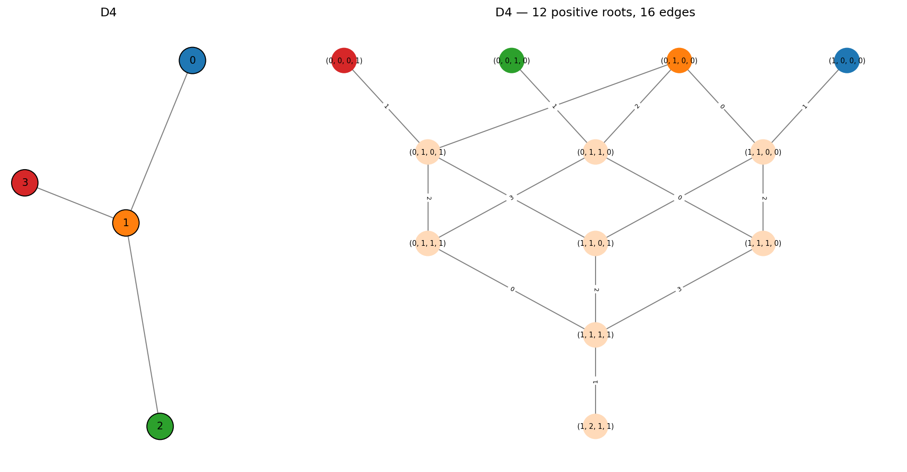
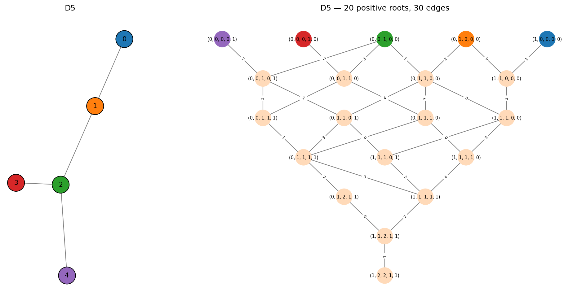
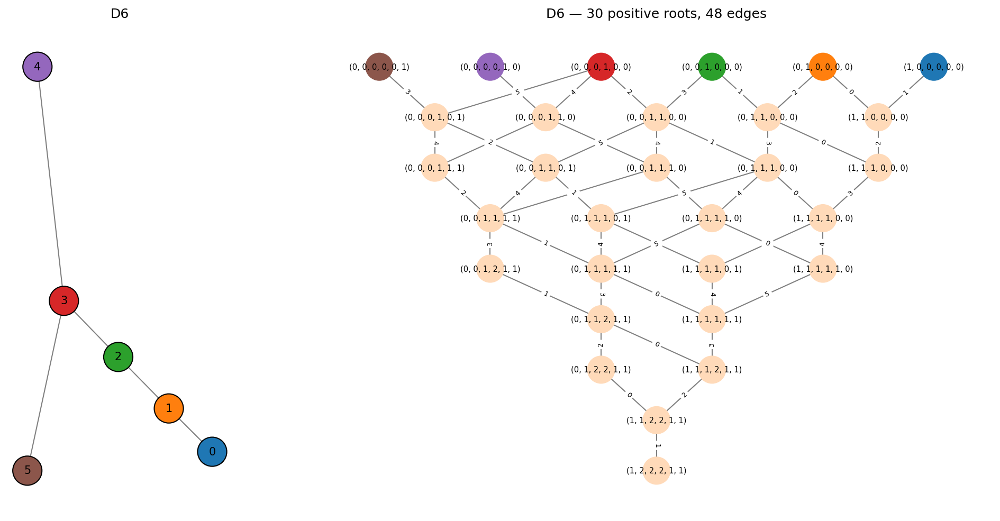

Type D -- Forked Graphs
=======================

The :math:`D_n` Dynkin diagram (:math:`n \geq 4`) is a path on :math:`n{-}1`
nodes with an extra branch at one end:

.. math::

   0 - 1 - \cdots - (n{-}3) \begin{cases} (n{-}2) \\ (n{-}1) \end{cases}

Node :math:`n{-}3` has degree 3, connecting to both :math:`n{-}2` and
:math:`n{-}1`. The root system has :math:`n(n{-}1)` positive roots and
:math:`2n(n{-}1)` roots in total. These correspond to the root system of the
special orthogonal Lie algebra :math:`\mathfrak{so}_{2n}`.

D4
--

The smallest D-type diagram, with 12 positive roots and 24 total.
D4 is notable for having a **triality symmetry** -- the three outer nodes
(0, 2, 3) are interchangeable, giving :math:`D_4` an unusually large
automorphism group (:math:`S_3`).

.. code-block:: pycon

   >>> from mutation_game import MutationGame
   >>> game = MutationGame.from_dynkin("D4")
   >>> print(game.adj)
   [[0 1 0 0]
    [1 0 1 1]
    [0 1 0 0]
    [0 1 0 0]]

Node 1 is the central hub connecting to nodes 0, 2, and 3.

The Cartan matrix and its spectrum:

.. code-block:: pycon

   >>> print(game.cartan_matrix())
   [[ 2 -1  0  0]
    [-1  2 -1 -1]
    [ 0 -1  2  0]
    [ 0 -1  0  2]]
   >>> print(game.cartan_eigenvalues())
   [0.58578644 2.         2.         3.41421356]

Note the double eigenvalue at 2, reflecting the triality symmetry.

D5
--

20 positive roots, 40 total. The root system of :math:`\mathfrak{so}_{10}`.

.. code-block:: pycon

   >>> game = MutationGame.from_dynkin("D5")
   >>> print(game.cartan_eigenvalues())
   [0.38196601 1.38196601 2.         2.61803399 3.61803399]

D6
--

30 positive roots, 60 total. The root system of :math:`\mathfrak{so}_{12}`.

