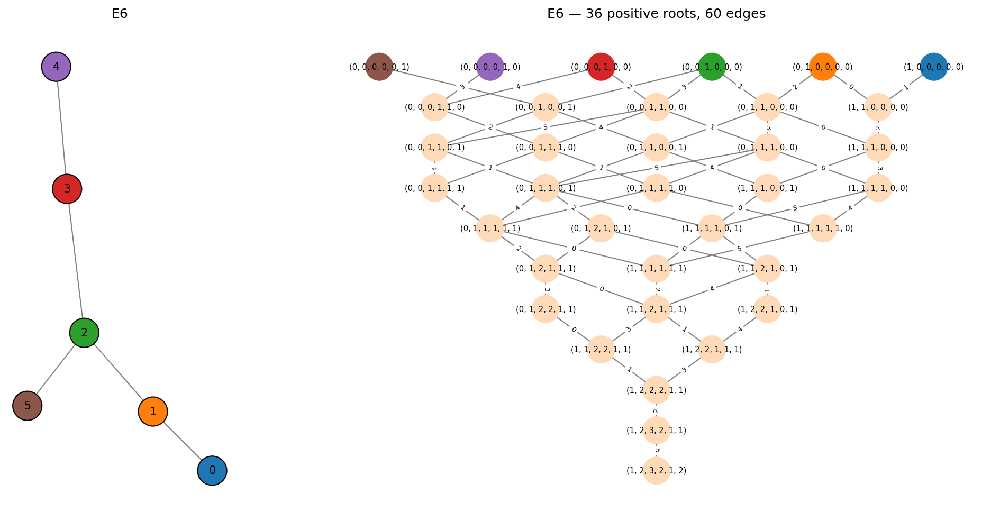
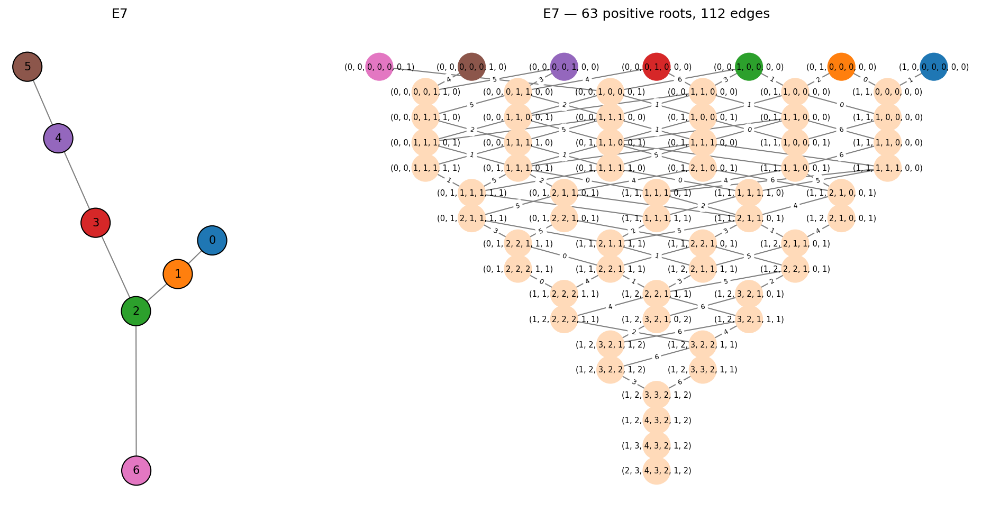
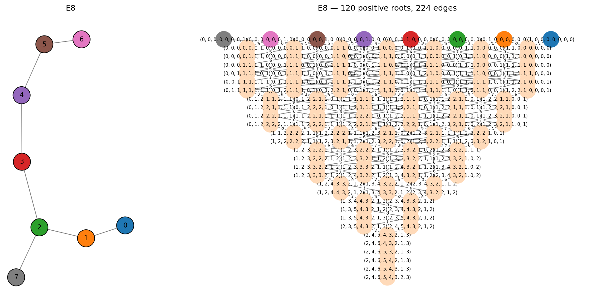

Type E -- Exceptional Diagrams
==============================

The exceptional Dynkin diagrams :math:`E_6`, :math:`E_7`, and :math:`E_8` are
the three "sporadic" simply-laced diagrams. Each is a path with a single branch
off the third node:

.. math::

   0 - 1 - 2 - 3 - \cdots - (n{-}2)
               |
             (n{-}1)

These correspond to the exceptional simple Lie algebras
:math:`\mathfrak{e}_6`, :math:`\mathfrak{e}_7`, and :math:`\mathfrak{e}_8`.
No other E-type diagrams produce finite root systems.

E6
--

36 positive roots, 72 total. The Lie algebra :math:`\mathfrak{e}_6` has
dimension 78 (72 root vectors + 6 Cartan generators).

.. code-block:: pycon

   >>> from mutation_game import MutationGame
   >>> game = MutationGame.from_dynkin("E6")
   >>> print(game.adj)
   [[0 1 0 0 0 0]
    [1 0 1 0 0 0]
    [0 1 0 1 0 1]
    [0 0 1 0 1 0]
    [0 0 0 1 0 0]
    [0 0 1 0 0 0]]

Node 2 is the branch point, connected to nodes 1, 3, and 5.

The Cartan spectrum:

.. code-block:: pycon

   >>> print(game.cartan_eigenvalues())
   [0.26794919 1.         1.26794919 2.73205081 3.         3.73205081]

E6 has a :math:`\mathbb{Z}/2\mathbb{Z}` diagram automorphism (the diagram is
symmetric under reflection), giving it a non-trivial outer automorphism.

E7
--

63 positive roots, 126 total. The Lie algebra :math:`\mathfrak{e}_7` has
dimension 133 (126 root vectors + 7 Cartan generators).

.. code-block:: pycon

   >>> game = MutationGame.from_dynkin("E7")
   >>> print(game.cartan_eigenvalues())
   [0.19806226 0.75487767 1.55495813 2.         2.80193774 3.24512233
    3.44504187]

The highest root in E7 has height 17 (the sum of its coordinates), making the
mutation graph 17 levels deep.

E8
--

120 positive roots, 240 total. :math:`E_8` is the largest exceptional root
system and one of the most remarkable objects in mathematics. The Lie algebra
:math:`\mathfrak{e}_8` has dimension 248 (240 root vectors + 8 Cartan
generators).

.. code-block:: pycon

   >>> game = MutationGame.from_dynkin("E8")
   >>> print(game.cartan_eigenvalues())
   [0.12061476 0.47213595 1.         1.57357644 2.34729636 2.87938524
    3.52786405 3.87938524]
   >>> roots = game.calculate_roots()
   >>> pos = [r for r in roots if all(x >= 0 for x in r)]
   >>> highest = max(pos, key=lambda r: sum(r))
   >>> print(list(map(int, highest)))
   [2, 4, 6, 5, 4, 3, 2, 3]

The highest root :math:`(2, 4, 6, 5, 4, 3, 2, 3)` has height 29. The Weyl
group of :math:`E_8` has order 696,729,600.
