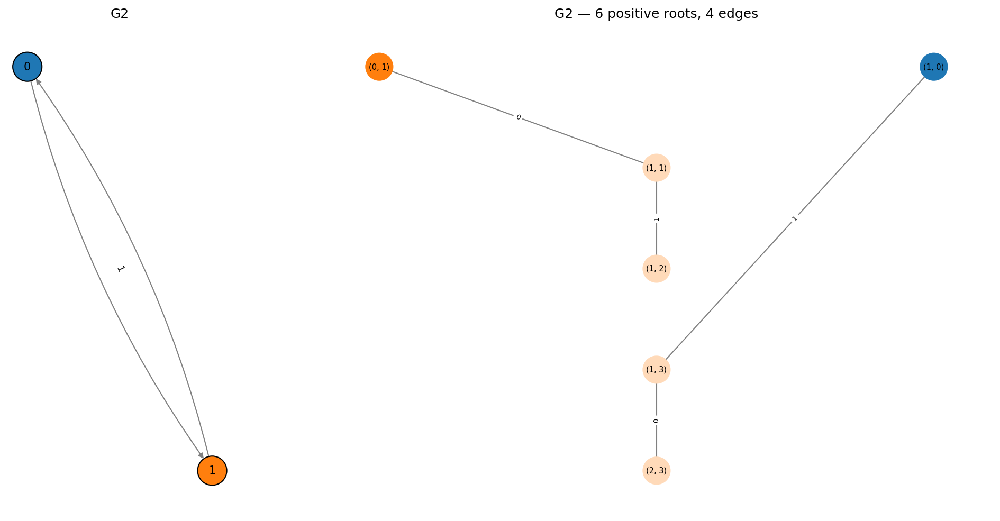
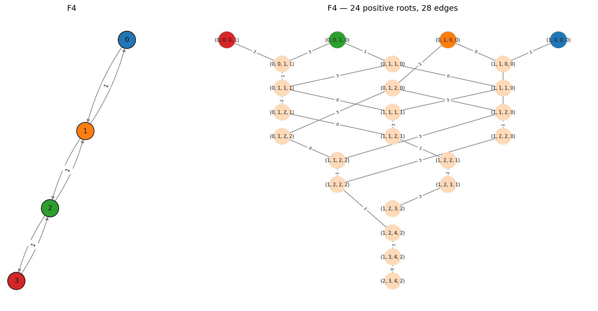

Types F and G -- Exceptional Multigraphs
========================================

The exceptional non-simply-laced Dynkin diagrams are :math:`F_4` and
:math:`G_2`. Together with :math:`E_6`, :math:`E_7`, :math:`E_8`, they
complete the list of exceptional finite-type root systems.

.. note::

   Unlike A, B, C, and D, which are infinite families parametrized by rank,
   :math:`F_4` and :math:`G_2` are isolated singletons -- there is no
   :math:`F_5`, :math:`G_3`, etc. The complete classification of finite-type
   Dynkin diagrams consists of exactly four infinite families
   (:math:`A_n, B_n, C_n, D_n`) and five exceptional singletons
   (:math:`E_6, E_7, E_8, F_4, G_2`). No others exist.

G2
--

The simplest non-simply-laced exceptional diagram: 2 nodes with a **(3,1)
directed edge** -- three edges from node 0 to node 1, one edge back.

.. code-block:: pycon

   >>> from mutation_game import MutationGame
   >>> game = MutationGame.from_dynkin("G2")
   >>> print(game.adj)
   [[0 3]
    [1 0]]

6 positive roots, 12 total. The Lie algebra :math:`\mathfrak{g}_2` has
dimension 14 (12 root vectors + 2 Cartan generators). It is the automorphism
algebra of the octonions.

.. code-block:: pycon

   >>> for r in game.calculate_roots():
   ...     if all(x >= 0 for x in r):
   ...         print(list(map(int, r)))
   [0, 1]
   [1, 0]
   [1, 1]
   [1, 2]
   [1, 3]
   [2, 3]

The highest root is :math:`(2, 3)` with height 5.

Note the asymmetry: mutating at node 1 receives 3 copies from node 0
(three incoming edges), while mutating at node 0 receives only 1 copy.
This produces the long/short root distinction characteristic of G2.

F4
--

Four nodes with simple edges on the outside and a **(2,1) directed edge** in
the middle:

.. math::

   0 - 1 \xRightarrow{2,1} 2 - 3

.. code-block:: pycon

   >>> game = MutationGame.from_dynkin("F4")
   >>> print(game.adj)
   [[0 1 0 0]
    [1 0 2 0]
    [0 1 0 1]
    [0 0 1 0]]

24 positive roots, 48 total. The Lie algebra :math:`\mathfrak{f}_4` has
dimension 52 (48 root vectors + 4 Cartan generators).

.. code-block:: pycon

   >>> roots = game.calculate_roots()
   >>> pos = [r for r in roots if all(x >= 0 for x in r)]
   >>> highest = max(pos, key=lambda r: sum(r))
   >>> print(list(map(int, highest)))
   [2, 3, 4, 2]

The highest root :math:`(2, 3, 4, 2)` has height 11.

The generalized Cartan matrix for F4 is non-symmetric:

.. code-block:: pycon

   >>> print(game.cartan_matrix())
   [[ 2 -1  0  0]
    [-1  2 -1  0]
    [ 0 -2  2 -1]
    [ 0  0 -1  2]]

The off-diagonal pair ``C[1,2] = -1`` and ``C[2,1] = -2`` reflects the
(2,1) directed edge between nodes 1 and 2.

Root count summary
------------------

.. list-table::
   :header-rows: 1

   * - Type
     - Graph structure
     - Positive roots
     - Total roots
   * - :math:`B_n` (:math:`n \geq 2`)
     - Path + (2,1) edge
     - :math:`n^2`
     - :math:`2n^2`
   * - :math:`C_n` (:math:`n \geq 3`)
     - Path + (1,2) edge
     - :math:`n^2`
     - :math:`2n^2`
   * - :math:`F_4`
     - 4 nodes, (2,1) middle
     - 24
     - 48
   * - :math:`G_2`
     - 2 nodes, (3,1) edge
     - 6
     - 12
